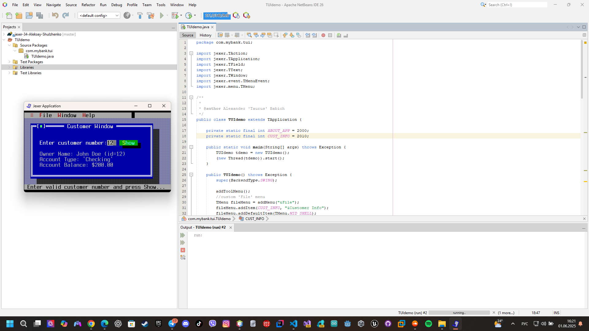

# UI Lab 1


Це одна з робіт, які доповнюють основний цикл лабораторних робіт #1-8 (проект **Banking**, [Netbeans](https://netbeans.org/)) з ООП.  Основна мета цих додаткових вправ - познайомитись з різними видами інтерфейсів користувача та засобами їх створення. Згадувані 'базові' роботи розміщено в [окремому репозиторії](https://github.com/liketaurus/OOP-JAVA) (якщо будете робити завдання на "4" або "5" раджу переглянути [діаграму класів](https://github.com/liketaurus/OOP-JAVA/blob/master/MyBank.png), аби розуміти які методи є у класів).

В ході першої роботи вам пропонується виконати **наступне завдання** - [Робота 1: TUI з Jexer](https://github.com/ppc-ntu-khpi/TUI-Lab1-Starter/blob/master/Lab%201%20-TUI/Lab%201.md)
  
**Додаткове завдання** (для тих хто зробив все і прагне більшого): [дивіться тут](https://github.com/ppc-ntu-khpi/TUI-Lab1-Starter/blob/master/Lab%201%20-TUI/Lab%201%20-%20add.md)

Всі необхідні бібліотеки містяться у теці [jars](https://github.com/ppc-ntu-khpi/TUI-Lab1-Starter/tree/master/jars). В тому числі - всі необхідні відкомпільовані класи з робіт 1-8 - файл [MyBank.jar](https://github.com/ppc-ntu-khpi/TUI-Lab1-Starter/blob/master/jars/MyBank.jar). Файл даних лежить у теці [data](https://github.com/ppc-ntu-khpi/TUI-Lab1-Starter/tree/master/data).

---
**УВАГА! Не забуваємо здавати завдання через Google Classroom та вказувати посилання на створений для вас репозиторій!**

Також пам'ятайте, що ніхто не заважає вам редагувати файл README у вашому репозиторії😉.
А ще - дуже раджу спробувати нову фічу - інтеграцію з IDE REPL.it (хоч з таким завданням вона може й не впоратись, однак, цікаво ж!).


 


## На "трійку"
Підключив бібліотеку, скомпілював java файл



## На "чотири"
Перепишіть метод ShowCustomerDetails з використанням класів Bank, Customer, Account та ін. з наших попередніх лаб - банк повинен мати як мінімум два клієнти, інформацію про яких (та про перші рахунки, що їм належать) ви маєте побачити, увівши номер клієнта. УВАГА! Класи можна взяти або з відповідного репозиторію, або взяти jar-файл з усіма необхідними класами з цього ж репозиторію та підключити його як бібліотеку (див. п.3 завдання "на трійку).

```java
package com.mybank.tui;

import jexer.TAction;
import jexer.TApplication;
import jexer.TField;
import jexer.TText;
import jexer.TWindow;
import jexer.event.TMenuEvent;
import jexer.menu.TMenu;

import java.util.ArrayList;
import java.util.List;

public class TUIdemo extends TApplication {

    private static final int ABOUT_APP = 2000;
    private static final int CUST_INFO = 2010;

    // Простий Bank
    static class Account {
        protected double balance;

        public Account(double balance) {
            this.balance = balance;
        }

        public double getBalance() {
            return balance;
        }

        public String getAccountType() {
            return "Generic";
        }
    }

    static class CheckingAccount extends Account {
        public CheckingAccount(double balance) {
            super(balance);
        }

        @Override
        public String getAccountType() {
            return "Checking";
        }
    }

    static class SavingsAccount extends Account {
        public SavingsAccount(double balance) {
            super(balance);
        }

        @Override
        public String getAccountType() {
            return "Savings";
        }
    }

    static class Customer {
        private String firstName;
        private String lastName;
        private List<Account> accounts = new ArrayList<>();

        public Customer(String firstName, String lastName) {
            this.firstName = firstName;
            this.lastName = lastName;
        }

        public void addAccount(Account acc) {
            accounts.add(acc);
        }

        public Account getAccount(int index) {
            return accounts.get(index);
        }

        public int getNumberOfAccounts() {
            return accounts.size();
        }

        public String getFirstName() {
            return firstName;
        }

        public String getLastName() {
            return lastName;
        }
    }

    static class Bank {
        private static List<Customer> customers = new ArrayList<>();

        public static void addCustomer(String f, String l) {
            customers.add(new Customer(f, l));
        }

        public static Customer getCustomer(int index) {
            if (index < 0 || index >= customers.size()) return null;
            return customers.get(index);
        }

        public static int getNumOfCustomers() {
            return customers.size();
        }
    }

    public static void main(String[] args) throws Exception {
        TUIdemo tdemo = new TUIdemo();
        (new Thread(tdemo)).start();
    }

    public TUIdemo() throws Exception {
        super(BackendType.SWING);

        addToolMenu();
        TMenu fileMenu = addMenu("&File");
        fileMenu.addItem(CUST_INFO, "&Customer Info");
        fileMenu.addDefaultItem(TMenu.MID_SHELL);
        fileMenu.addSeparator();
        fileMenu.addDefaultItem(TMenu.MID_EXIT);

        addWindowMenu();

        TMenu helpMenu = addMenu("&Help");
        helpMenu.addItem(ABOUT_APP, "&About...");

        setFocusFollowsMouse(true);

        // Додаємо 2 клієнтів
        Bank.addCustomer("John", "Doe");
        Bank.getCustomer(0).addAccount(new CheckingAccount(200.0));

        Bank.addCustomer("Jane", "Smith");
        Bank.getCustomer(1).addAccount(new SavingsAccount(500.0));

        ShowCustomerDetails();
    }

    @Override
    protected boolean onMenu(TMenuEvent menu) {
        if (menu.getId() == ABOUT_APP) {
            messageBox("About", "\t\t\t\t\t   Just a simple Jexer demo.\n\n(c) 2025").show();
            return true;
        }
        if (menu.getId() == CUST_INFO) {
            ShowCustomerDetails();
            return true;
        }
        return super.onMenu(menu);
    }

    private void ShowCustomerDetails() {
        TWindow custWin = addWindow("Customer Window", 2, 1, 40, 10, TWindow.NOZOOMBOX);
        custWin.newStatusBar("Enter valid customer number and press Show...");

        custWin.addLabel("Enter customer number: ", 2, 2);
        TField custNo = custWin.addField(24, 2, 3, false);
        TText details = custWin.addText("Owner Name: \nAccount Type: \nAccount Balance: ", 2, 4, 38, 8);

        custWin.addButton("&Show", 28, 2, new TAction() {
            @Override
            public void DO() {
                try {
                    int custNum = Integer.parseInt(custNo.getText());
                    Customer customer = Bank.getCustomer(custNum);
                    if (customer == null) throw new IndexOutOfBoundsException();

                    StringBuilder sb = new StringBuilder();
                    sb.append("Owner Name: ")
                      .append(customer.getFirstName()).append(" ")
                      .append(customer.getLastName())
                      .append(" (id=").append(custNum).append(")\n");

                    if (customer.getNumberOfAccounts() > 0) {
                        Account acc = customer.getAccount(0);
                        sb.append("Account Type: ").append(acc.getAccountType()).append("\n");
                        sb.append("Account Balance: $").append(String.format("%.2f", acc.getBalance()));
                    } else {
                        sb.append("No accounts found.");
                    }

                    details.setText(sb.toString());

                } catch (Exception e) {
                    messageBox("Error", "Invalid customer number!").show();
                }
            }
        });
    }
}
```


## На "п'ять"

Перепишіть метод ShowCustomerDetails з використанням класів Bank, Customer, Account та ін. з наших попередніх лаб - інформація про клієнтів банку та їх рахунках має читатись з файлу test.dat (робота номер 8, файл даних також є в цьому ж репозиторію). Інформацію про клієнта (та про перший рахунок, що йому належить) ви маєте побачити, увівши номер клієнта.
Запустіть проект, впевніться, що все працює як очікувалось. Продемонстрируйте результат викладачеві.

```java
package com.mybank.tui;

import jexer.*;
import jexer.event.TMenuEvent;
import jexer.menu.TMenu;

import java.io.*;
import java.util.List;

class Account implements Serializable {
    protected double balance;

    public Account(double balance) {
        this.balance = balance;
    }

    public double getBalance() {
        return balance;
    }

    public String getAccountType() {
        return "Generic";
    }
}

class CheckingAccount extends Account {
    public CheckingAccount(double balance) {
        super(balance);
    }

    @Override
    public String getAccountType() {
        return "Checking";
    }
}

class SavingsAccount extends Account {
    public SavingsAccount(double balance) {
        super(balance);
    }

    @Override
    public String getAccountType() {
        return "Savings";
    }
}

class Customer implements Serializable {
    private String firstName;
    private String lastName;
    private List<Account> accounts;

    public Customer(String f, String l, List<Account> accs) {
        this.firstName = f;
        this.lastName = l;
        this.accounts = accs;
    }

    public String getFirstName() {
        return firstName;
    }

    public String getLastName() {
        return lastName;
    }

    public List<Account> getAccounts() {
        return accounts;
    }
}

public class TUIdemo extends TApplication {

    private static final int ABOUT_APP = 2000;
    private static final int CUST_INFO = 2010;

    private List<Customer> customers;

    public static void main(String[] args) throws Exception {
        TUIdemo app = new TUIdemo();
        (new Thread(app)).start();
    }

    public TUIdemo() throws Exception {
        super(BackendType.SWING);

        addToolMenu();

        TMenu fileMenu = addMenu("&File");
        fileMenu.addItem(CUST_INFO, "&Customer Info");
        fileMenu.addDefaultItem(TMenu.MID_SHELL);
        fileMenu.addSeparator();
        fileMenu.addDefaultItem(TMenu.MID_EXIT);

        addWindowMenu();

        TMenu helpMenu = addMenu("&Help");
        helpMenu.addItem(ABOUT_APP, "&About...");

        setFocusFollowsMouse(true);

        // Укажи СВОЙ путь к файлу!
       loadCustomersFromFile("test/test.dat");

        ShowCustomerDetails();
    }

    private void loadCustomersFromFile(String filepath) {
        try (ObjectInputStream in = new ObjectInputStream(new FileInputStream(filepath))) {
            customers = (List<Customer>) in.readObject();
        } catch (Exception e) {
            customers = null;
            System.out.println("Ошибка загрузки: " + e.getMessage());
        }
    }

    @Override
    protected boolean onMenu(TMenuEvent menu) {
        if (menu.getId() == ABOUT_APP) {
            messageBox("About", "Simple Jexer Demo\nAuthor: Taurus Babich").show();
            return true;
        }
        if (menu.getId() == CUST_INFO) {
            ShowCustomerDetails();
            return true;
        }
        return super.onMenu(menu);
    }

    private void ShowCustomerDetails() {
        TWindow custWin = addWindow("Customer Info", 2, 1, 50, 12, TWindow.NOZOOMBOX);
        custWin.newStatusBar("Enter customer number and press Show...");

        custWin.addLabel("Enter customer number: ", 2, 2);
        TField custNo = custWin.addField(28, 2, 5, false);
        TText details = custWin.addText("", 2, 4, 46, 6);

        custWin.addButton("&Show", 35, 2, new TAction() {
            @Override
            public void DO() {
                try {
                    int custId = Integer.parseInt(custNo.getText());

                    if (customers == null) {
                        details.setText("No data loaded.");
                        return;
                    }

                    if (custId < 0 || custId >= customers.size()) {
                        details.setText("Customer ID out of bounds!");
                        return;
                    }

                    Customer c = customers.get(custId);
                    Account acc = c.getAccounts().get(0); // первый аккаунт

                    String text = "Owner Name: " + c.getFirstName() + " " + c.getLastName() + "\n" +
                                  "Account Type: " + acc.getAccountType() + "\n" +
                                  "Account Balance: $" + acc.getBalance();
                    details.setText(text);
                } catch (Exception e) {
                    details.setText("Invalid input!");
                }
            }
        });
    }
}

```


